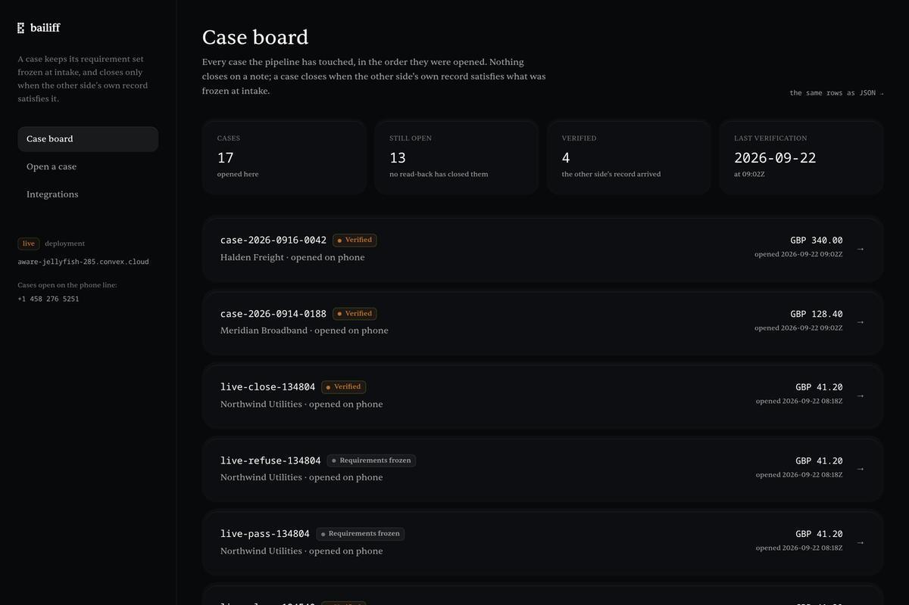
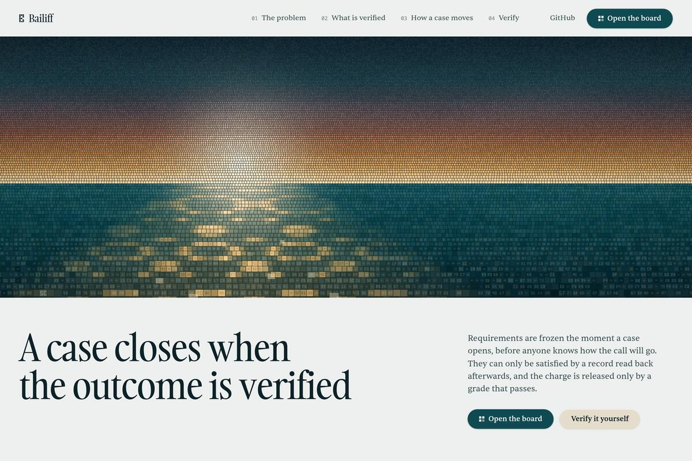
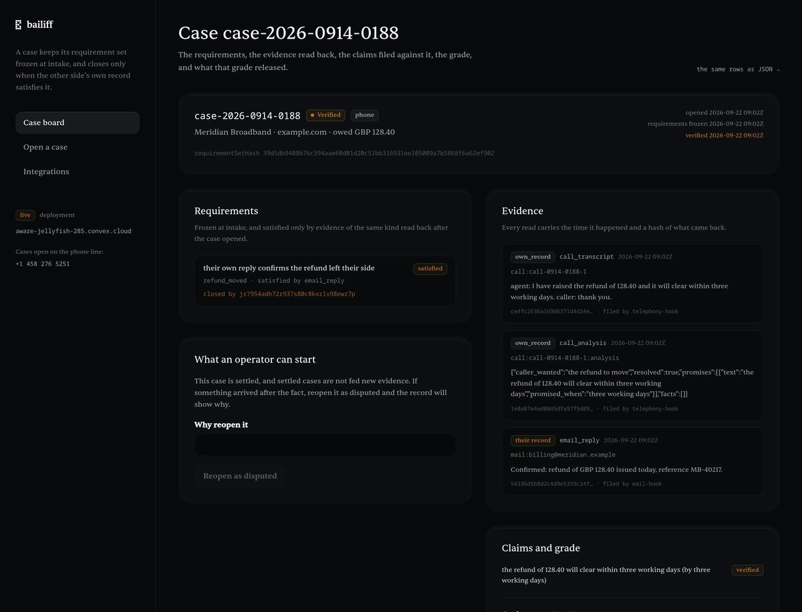
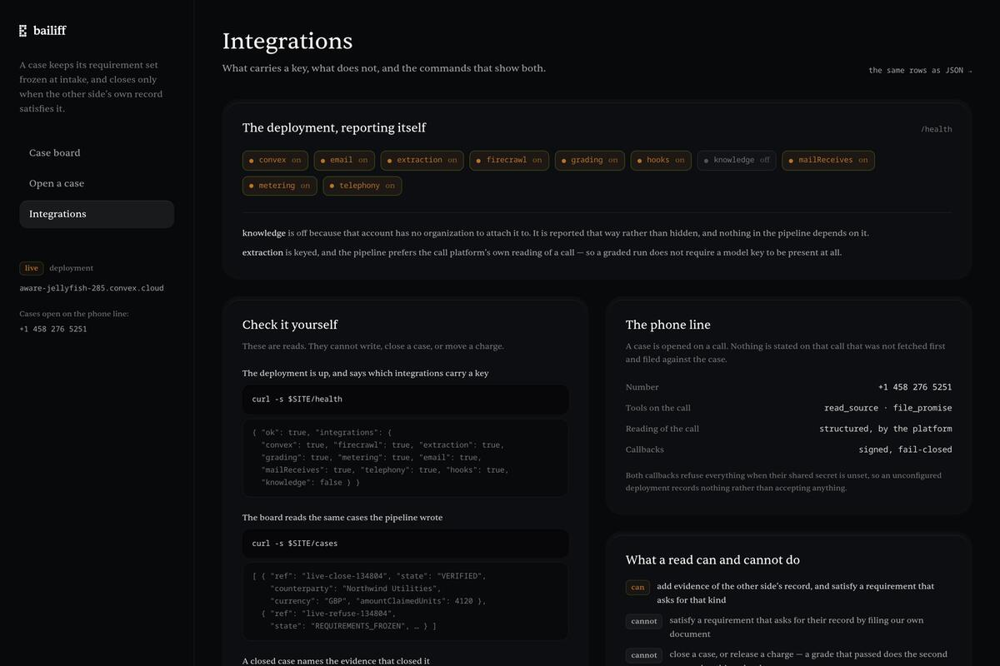

<div align="center">

# BAILIFF

### A case against a company that owes you stays open until their own record proves the outcome.

[](#tests)
[](https://aware-jellyfish-285.convex.site)
[](LICENSE)


[](https://youtu.be/nlCXhzFYia4) [](demo/bailiff-clickthrough.mp4) [](#whats-real-vs-pending--the-honesty-table) [](#-see-it-in-one-command)

</div>

Chasing money someone owes you is a correspondence problem with no memory. You send the message, someone half-answers, the thread dies, and three weeks later nobody can say what was even promised. BAILIFF answers the harder question instead of the easy one: **not "did we ask them again?" but "does the other side's own material show the outcome?"** A case opens with the facts that must be true for it to be over, frozen and hashed before anyone is contacted. Every read is fetched on the server and stored with the time it happened and a hash of what came back. A promise is graded against our own recording of the call; a claim about what *they* did needs *their* record. When the requirement is satisfied the case closes pointing at the evidence that closed it — and the charge is released only by a grade that passed, which printed every check it made. Ask it to close early and it refuses, naming the requirement that has nothing behind it.

```
SAID  ≠  READ  ≠  PROVEN
```

There is no `CLOSED_WITH_WARNINGS`. Either the requirement was satisfied by material read back after the case opened and belonging to the side that owns the fact, or the case stays open and says which requirement has nothing behind it. The refusal is the product.

## Live status

**Every row below was run against the deployment**, not against a local copy. `/selftest` writes four bytes to storage, reads them back, removes them, and reports anything it could not check as **skipped rather than passing** — because a green tick for a check nobody ran is the exact failure this project exists to catch.

| Surface | Status | The evidence |
|---|---|---|
| The deployment | **LIVE** | `/health` reports **9 of 10** integrations carrying a key; the tenth says so itself |
| The board | **LIVE** | 20 cases, rendered from the same rows `/cases` returns, clickable through to each one |
| The self-test | **LIVE** | 5 checks: integrations, **storage written and read back**, mail path, 20 cases readable, the grade's rubric intact |
| A case closing | **LIVE** | a case that was refused closed only once the counterparty's own reply arrived, and it names that reply |
| Firecrawl | **LIVE** | a real page fetched, its text stored with the time and a hash of what came back |
| AgentMail | **LIVE** | the report sent, the reply received, and the reply filed as the evidence that closed the case |
| The call platform | **LIVE** | a number answers on this project's own assistant, carrying the server URL, the shared secret and both tools |
| Metering | **LIVE** | a metered event accepted, keyed on the call reference that justified it |
| OpenAI | **KEYED, 402** | the provider answers `402 insufficient_quota` until credit lands. It does not block the pipeline: claims come from the call platform's own end-of-call analysis, so money is decided without any model key |
| Inkeep | **OFF** | that account belongs to no organization. `/health` reports it `false` rather than pretending |
| The build, posted | **LIVE** | [https://x.com/KomariS18774/status/2102368912549753004](https://x.com/KomariS18774/status/2102368912549753004) — tagged to the four sponsors, as the event asks |

## ▶ Demo

[](https://youtu.be/nlCXhzFYia4)

**[▶ Watch the demo (1:40)](https://youtu.be/nlCXhzFYia4)** &nbsp;·&nbsp; **[ Click-through ↗ ](demo/bailiff-clickthrough.mp4)** &nbsp;·&nbsp; **[ What's real vs pending ↗ ](#whats-real-vs-pending--the-honesty-table)** &nbsp;·&nbsp; **[ Run it yourself ↗ ](#-see-it-in-one-command)**

_Two cuts, both under three minutes. The explainer opens on the rule the product enforces and closes on what it cannot verify; everything between is the live deployment. The click-through is the same product with twelve real interactions, a caption on each, and nothing else. Every frame came from the deployment — no mock state, no invented numbers, and the two refusals shown are refusals the backend actually returned._

## The 20-second pitch

A refund that never arrived. You can prove what you sent. You cannot prove what they never said, and the arithmetic of "did the money actually move" lives entirely in their systems. So the thread goes quiet, and the case dies of politeness.

The second wound is quieter. Somebody on a call says "that's sorted" and everyone moves on. Nothing recorded can be held to, and three weeks later the promise is a memory with a date on it.

**BAILIFF is a case file with a gate on it.** The requirement set is frozen and hashed at intake. Reads carry their own receipts. Promises are graded against the transcript we recorded. Claims about the other side need the other side's material. Closure and money both sit behind the same gate, and a refusal names the requirement it refused on.

## Table of contents

- [Live status](#live-status)
- [▶ Demo](#-demo)
- [The 20-second pitch](#the-20-second-pitch)
- [▶ See it in one command](#-see-it-in-one-command)
- [Screenshots](#screenshots)
- [Verify every claim in one command](#verify-every-claim-in-one-command)
- [What BAILIFF is NOT](#what-bailiff-is-not)
- [The problem I set out to solve](#the-problem-i-set-out-to-solve)
- [What I built](#what-i-built)
- [Architecture](#architecture)
- [The close loop, step by step](#the-close-loop-step-by-step)
- [Where the guarantee is enforced](#where-the-guarantee-is-enforced)
- [What the grade measures](#what-the-grade-measures)
- [Where the model sits](#where-the-model-sits)
- [Who approves what](#who-approves-what)
- [Engineering decisions & the traps that taught me something](#engineering-decisions--the-traps-that-taught-me-something)
- [What's real vs pending — the honesty table](#whats-real-vs-pending--the-honesty-table)
- [Attack → test](#attack--test)
- [The app](#the-app)
- [Limitations](#limitations)
- [Security](#security)
- [Tech stack](#tech-stack)
- [Project layout](#project-layout)
- [Full command reference](#full-command-reference)
- [How I'd deploy it](#how-id-deploy-it)
- [Results and supporting records](#results-and-supporting-records)
- [Tests](#tests)
- [License](#license)

## ▶ See it in one command

No vendor keys and no network beyond the deployment — the rules are tested as rules:

```bash
$ npm install && npm test
 Test Files  13 passed (13)
      Tests  132 passed (132)
   Duration  16.30s
```

```bash
$ curl -s https://aware-jellyfish-285.convex.site/selftest | python3 -m json.tool
{
    "checks": [
        { "name": "integrations", "ok": true,
          "detail": "9 on (convex, firecrawl, extraction, grading, metering, email, mailReceives, telephony, hooks); off: knowledge" },
        { "name": "storage", "ok": true,
          "detail": "wrote 4 bytes, read them back, and removed them again" },
        { "name": "mailPath", "ok": true,
          "detail": "mail goes out through agentmail" },
        { "name": "casesReadable", "ok": true,
          "detail": "20 case(s) on the deployment" }
    ],
    "ran": 5, "failed": 0, "skipped": 0, "ok": true
}
```

## Screenshots

| The landing page | One case, end to end |
|---|---|
| [](docs/screenshots/landing.jpg) | [](docs/screenshots/case.jpg) |

| The board, every case it has touched | The deployment, reporting itself |
|---|---|
| [](docs/screenshots/board.jpg) | [](docs/screenshots/integrations.jpg) |

## Verify every claim in one command

Three reads, no auth, nothing that can change anything:

```bash
$ curl -s https://aware-jellyfish-285.convex.site/health \
  | python3 -c "import sys,json; d=json.load(sys.stdin); print(d['ok'], sum(1 for v in d['integrations'].values() if v), 'of', len(d['integrations']))"
True 9 of 10

$ curl -s https://aware-jellyfish-285.convex.site/cases \
  | python3 -c "import sys,json; print(len(json.load(sys.stdin)), 'cases')"
20 cases

$ curl -s "https://aware-jellyfish-285.convex.site/case?ref=case-2026-0914-0188" \
  | python3 -c "import sys,json; d=json.load(sys.stdin); print(d['proof']['state'], d['proof']['grade']['verdict'])"
VERIFIED pass
```

The `proof` block on a single case is the whole claim in a size you can diff: the requirement-set hash, each requirement with the source and the hash of the evidence that satisfied it, the grade with its checks, and the charge's state.

## What BAILIFF is NOT

- **Not a chatbot over your inbox.** Nothing here answers questions. It decides whether a case may close and whether money may be charged, and it refuses.
- **Not a payment rail.** No funds move through this. The charge is a ledger row a passing grade released; the product's job is to make that row impossible to write by accident.
- **Not a letter generator.** It does not draft prose for you to argue with. It sends one message per step, with the case reference in it, and files what comes back.
- **Not a replacement for a lawyer or a court.** It is the record you would want when you get there: what you asked for, when they were asked, what came back, and what is still missing.

## The problem I set out to solve

Unexplained-message disputes are one-sided by construction. You can prove what you sent. You cannot prove what they never said, and the arithmetic of "did the refund actually move" lives entirely in their systems. The asymmetry is the whole problem: the party with the information has no reason to hand it over, and the party without it has no way to force the question.

Software usually answers this with a nicer inbox. That is a filing cabinet. Filing cabinets do not close anything — they just make the silence tidier. The question I wanted answered was narrower and harder: **what would it take for this to be over, and can that condition be checked without trusting either side's account of it?**

## What I built

- **A case ledger on Convex** — the case, its frozen requirements, its evidence, its claims, its grades, its charge, and its audit trail, all in one schema where the money-adjacent fields can only be written by the code that checks them.
- **Freeze and hash at intake.** The requirement set is hashed when the case opens. A test proves a changed set produces a different hash, so a moved goalpost is visible rather than arguable.
- **Server-side reads with receipts.** A page read, an inbound email, a call transcript, or the owner's uploaded file — each stored with its kind, its source, the time it was read, and a hash of what came back.
- **A grade that prints its checks.** Every claim is judged by where it stands: a promise against our own recording, a claim about the counterparty against their material. Unverified rubrics bill nothing.
- **A billing gate.** The charge is written exactly once, keyed on the call reference, and only by a grade that passed.
- **A chase cadence with an ending.** Cases chase what is outstanding on a schedule, and then are abandoned **with the reason and the list of what never came back**.
- **File storage that hashes what arrived** — not a description of it.
- **A board, a landing page, a self-test, and insights** — all reading the same rows the JSON routes return.

## Architecture

Convex is the entire backend: the ledger, the workflow, the scheduled sweeps, the HTTP hooks, file storage, and static hosting for the site. There is no server of ours to deploy, no queue to babysit, and no separate database to keep in sync.

```
        browser                      Convex                        the world
  ┌──────────────────┐     ┌──────────────────────────┐     ┌────────────────────┐
  │ landing          │     │ cases · verify · grade   │     │ the company's page │
  │ board            │◄───►│ orchestrator · chase     │◄───►│ their reply        │
  │ upload (client)  │     │ attachments · insights   │     │ the phone line     │
  └──────────────────┘     │ crons · http hooks       │     └────────────────────┘
        reads only         └──────────────────────────┘
   (never asserts a read)    every vendor call is an action or a
                             component call, so it lands in the same
                             transaction log as the thing it justifies
```

### The states a case moves through

```
OPEN ──► FROZEN ──► CHASING ──► VERIFIED
  │         │           │
  │         │           └──► ABANDONED   reason + what was never read back
  │         └──► DISPUTED               a closure withdrawn when it ages out
  └──► REFUSED                          a close attempt that could not be justified
```

### Component by component

| Piece | What it does |
|---|---|
| `convex/cases.ts` | Opens a case, freezes and hashes its requirements, closes it — only through the verifier |
| `convex/verifier.ts` | Re-reads the requirement and evidence rows every time it is asked; refusals name the requirement and the reason |
| `convex/orchestrator.ts` | The pipeline: read, extract, grade, meter, report — each step writing what it did |
| `convex/grades.ts` | Judges claims, prints its checks, and is the only thing that can release a charge |
| `convex/attachments.ts` | Uploads to storage, hashed from the bytes that arrived, matched by the same rule the close gate uses |
| `convex/chase.ts` | Asks what is outstanding, sends, and eventually abandons with a reason |
| `convex/insights.ts` | Outcomes rather than counts: time to closure, why closures are refused, who keeps coming back |
| `convex/selftest.ts` | The deployment checking itself, storage round trip included |
| `convex/http/*.ts` | The HTTP surface: reads anyone may make, hooks that run only with a shared secret |
| `convex/integrations/*` | One module per vendor, each with a stubbed-transport test and a live probe |

### The HTTP surface

| Route | Method | Who may call it |
|---|---|---|
| `/health` | GET | anyone — which integrations carry a key |
| `/selftest` | GET | anyone — the deployment checking itself |
| `/cases`, `/case?ref=` | GET | anyone — the same rows the board renders, plus a `proof` block |
| `/dashboard` | GET | anyone — the board, served from static hosting |
| the board's actions | — | **an operator session only**: closing, reopening, spending a call, taking a file |
| `/hooks/call-ended` | POST | the call platform only, with a shared secret |
| `/hooks/inbound-email`, `/hooks/agentmail` | POST | the mail provider only, with a shared secret |
| `/hooks/vapi-tools` | POST | the voice assistant's tools only, with a shared secret |

## The close loop, step by step

1. **Freeze.** A reference, a company, what is owed, and the facts that must be true for the case to be over. The set is hashed at intake. The browser cannot rewrite it; the only thing a client may attach is the owner's own document.
2. **Read.** The server fetches, times, and hashes. A counterparty page, an inbound reply, a call transcript, an owner's file — each lands as evidence of its own kind.
3. **Grade.** Claims are extracted and judged one by one. A promise is checked against our own recording; a claim about the counterparty needs their record. The grade prints every check and names any that failed.
4. **Release.** A `pass` writes the charge **exactly once**, keyed on the call reference. A `fail` writes nothing. Either way the outcome is on the case and in the audit trail.
5. **Chase, then stop.** Nothing outstanding means no chase. Something outstanding chases on a cadence, and after the last attempt the case is abandoned with the reason and the list of what never came back.

## Where the guarantee is enforced

| The guarantee | Enforced in | Covered by |
|---|---|---|
| A requirement set cannot be rewritten after intake | the freeze, and the hash stored with the case | a changed set produces a different hash |
| Evidence only counts if it was read after the case opened | the verifier, on every ask | a read from before the freeze never satisfies |
| A claim about the counterparty needs the counterparty's material | the authority rule | an owner's file cannot satisfy a requirement asking for the other side's |
| A charge cannot be written without a passing grade | the billing gate | a missing grade bills nothing; a failed grade bills nothing |
| A charge cannot be written twice | the exactly-once key | a replayed webhook does not bill again |
| An unrun check cannot pass | the grade's rubric | an unchecked rubric item is unverified, and unverified bills nothing |
| Hooks cannot be forged | the shared secret, fail-closed | a hook without the secret is refused |

## What the grade measures

- **Whether the evidence was read after the case opened** — the freshness rule, applied per requirement.
- **Whether it came from the right side** — a promise is ours to prove, a claim about them is theirs.
- **Whether the kind matches** — a page read cannot satisfy a requirement that asks for their reply, and vice versa.
- **Whether every rubric item was actually checked** — anything the grader could not check is reported as unverified, and unverified bills nothing.
- **Whether the case may close** — which is a separate decision from whether it may bill, and a case can be refused a closure for weeks while the charge stays unwritten.

## Where the model sits

The model does one job: turn a transcript into claims, at zero temperature, in a fixed shape. It cannot cast a verdict, cannot close a case, and cannot write a charge — a claim is not allowed to carry its own verdict. And it is the *fallback*: the pipeline prefers the call platform's own end-of-call analysis, so the pipeline can decide money with no model key present at all. That is why the `402` above is an inconvenience rather than a blocker.

## Who approves what

| Action | Who can do it | What it can change |
|---|---|---|
| Open a case, freeze its requirements | the owner | the ledger, before anything is filed |
| Upload the owner's own document | the owner, from the client | evidence of kind `own_document` only |
| Read a page as evidence | an operator action | evidence of its kind, filed with the time and the hash |
| File a claim about the counterparty | the ingest path only | claims attributed to the counterparty |
| Close a case | the verifier alone | state only — and only when the requirement is satisfied |
| Release the charge | the grade, on a pass | the billing row, once |

## Engineering decisions & the traps that taught me something

- **A state you can name but never reach is a lie in the schema.** `CHASING` was declared and drawn, and nothing ever entered it: there was no code that would ever chase. It now schedules its own first chase when requirements freeze, sweeps hourly, chases three times at most, and then abandons with a reason.
- **Write the pointer in the same transaction as the move.** A case could reach `VERIFIED` while its requirement still read `unsatisfied`, because the pointer was written by a second call. Two writes that must agree belong in one transaction.
- **A grade belongs to the thing it judged, and the view has to ask the same question.** Grades were recorded against the call while the case view asked at case level, so a graded case rendered with no grade on it. The query was fixed and a regression test added.
- **A build that succeeds while producing nothing is worse than a build that stops.** The board deployed once with no deployment address: the export succeeded, the upload succeeded, and the site opened saying "No backend is configured". The build now refuses without it and says where to put it.
- **A moving picture that ends before its narration freezes on screen.** The video assembly now refuses to cut a motion segment shorter than the line it carries — it caught one on the first run.
- **A capture of the wrong shape fills the frame or fails.** A 1280×577 screenshot cropped into a 1920×1080 frame produced a segment with no video stream; stills are now scaled to cover whatever shape they arrive in.

## What's real vs pending — the honesty table

| Thing | State |
|---|---|
| Case state machine, verifier, requirement freezing and hashing | Real, covered by tests |
| Claim verdicts, evidence freshness and authority rules | Real, covered by tests |
| Billing gate, exactly-once charge | Real, covered by tests |
| The chase cadence, and abandoning with a reason | Real, verified live |
| Webhooks | Real, fail-closed without the shared secret |
| File uploads | Real: uploaded, hashed from the bytes, readable again |
| Firecrawl, AgentMail, the call platform, metering, tracing | Keyed and exercised live |
| OpenAI extraction | Keyed; the provider answers `402 insufficient_quota` until credit lands. The pipeline prefers the call platform's own reading of the call, so this does not block anything |
| Inkeep | Off: that account belongs to no organization. `/health` reports it `false` |
| Dialling out anywhere | Refused by the phone platform's own daily limit on purchased numbers. Inbound works, and the board shows the platform's own sentence verbatim rather than pretending the call happened |
| The assistant never stating an unread number | Mechanism in place, not yet exercised on a live call |
| The board, health, self-test, and both JSON routes | Live, and every row above was run against them |

No screen in this project renders a value that did not come from a real read.

## Attack → test

| The attack | The test that answers it |
|---|---|
| File a hook without the shared secret, hoping a forged "call ended" closes a case | `refuses a call webhook outright when no secret is configured, instead of accepting it` |
| Replay a webhook to bill twice | `bills once behind a passing grade, and a replayed webhook does not bill again` |
| Satisfy a requirement with your own file when it asks for theirs | `does not let an owner's file satisfy a requirement that asks for the other side's` |
| Read evidence from before the case opened | `accepts evidence read at the moment the case opened`, and refuses anything earlier |
| Satisfy a requirement with a forum post or a model's summary | `does not count a forum post or a model's summary` |
| Let a claim carry its own verdict | `does not let a claim carry a verdict of its own` |
| Write a charge with no grade behind it | `a missing grade can never bill` |
| Leave a rubric item unchecked and hope it passes | `an unchecked rubric item is unverified, and unverified bills nothing` |
| Move the goalposts after the fact | `gives a different hash when the set actually differs` |
| Chase a case that nothing is outstanding on | `does not chase a case that nothing is outstanding on` |
| Let a case run forever rather than admit defeat | `abandons a case once the cadence has run out, naming what was never read back` |
| Open a case with a reference that cannot be one | `does not accept a reference with punctuation that cannot be a case` |

## The app

The board lists every case it has touched, newest first, with the outcomes counted from the same rows the list renders. A case opens into its requirements, the evidence read back, the claims filed against it, the grade with its checks, the charge, and the audit trail — with the operator actions that can add evidence, and a refusal that names the requirement when you ask it to close too early. Every case has `this record as JSON →`.

The landing page states what is verified and what is not, side by side, because a product whose whole argument is "prove it" should not hide its own gaps.

## Limitations

- **One operator.** There is no multi-user model: no roles, no seats, no sharing. The mailbox is the case's, and the person running it is you.
- **The refusal that has not been exercised on a live call.** The assistant is instructed never to state a number it has not read; the mechanism is in place, and it has not yet been tested against a real caller who tries to get it to guess.
- **No real debtor.** Every case on the deployment was created by driving the product, which is what "no sample data" means here: the records are real records of a real deployment, made against a counterparty that does not owe anyone anything.
- **OpenAI and Inkeep** as the honesty table describes.
- **Nothing here is legal advice**, and a case file is not a claim in a court.

## Security

- **Hooks fail closed.** Every `/hooks/*` route requires a shared secret and refuses without it, so a forged "call ended" cannot close a case or move money.
- **Secrets never touch a command line.** Deployment variables are pushed with `env set --from-file`; the values live in `.env.local` (git-ignored, mode 600). Nothing secret is printed, logged, or returned by `/health`, which reports presence rather than values.
- **The browser is not trusted.** Reads happen on the server. The client can attach the owner's own document and nothing else; it cannot assert what a page said.
- **Uploads are bounded.** A type or size the rule does not accept is refused with the reason, and a refused upload is deleted rather than left in storage.
- **The money path is keyed.** The charge is written once, keyed on the call reference, so a retry or a replay cannot bill twice.

## Tech stack

**Backend** Convex — database, functions, crons, HTTP actions, file storage, static hosting · **Frontend** Next.js App Router, static export · **Language** TypeScript end to end, types generated from the schema · **Tests** Vitest, 132 across 13 files · **Sponsors** OpenAI, Firecrawl, AgentMail · **Also wired** the call platform, metering, tracing.

## Project layout

```
convex/            the case, the pipeline, the gates, the adapters, the routes
frontend/          the site: the landing page and the board
demo/              the video, the stills it was cut from, the click sheet, the narration
tests/             132 tests across 13 files
docs/              integrations, deployments, the demo, what a live run printed
scripts/           deploy, the live end-to-end run, the video assembly
hackathon.md       the build log, including what a live deployment found
```

## Full command reference

```bash
npm test                      # the rules, 132 tests, no vendor keys needed
npm run typecheck             # no errors
npx convex dev                # the backend, against your own deployment
cd frontend && npm run dev    # the site (build refuses without NEXT_PUBLIC_CONVEX_URL)

./scripts/deploy.sh           # functions + deployment variables, then /health
cd frontend && npm run build && npx @convex-dev/static-hosting upload -d out

python3 scripts/live_e2e.py   # a real case, three ways, against the deployment
npx convex run selftest:run   # the same self-test, from the CLI
```

## How I'd deploy it

Point `CONVEX_DEPLOY_KEY` at a production deployment, run `./scripts/deploy.sh`, build the site with `NEXT_PUBLIC_CONVEX_URL` set to that deployment's cloud URL, and upload the export. Then set the hook secrets, point the call platform and the mailbox at the deployment's HTTP actions, and put an auth layer in front of the board before letting anyone else touch it. The variables it wants are all named in `/health`'s output when they are missing.

## Results and supporting records

- **[The demo](https://youtu.be/nlCXhzFYia4)** — 1:40, and the [click-through](demo/bailiff-clickthrough.mp4) at 61 seconds.
- **[`hackathon.md`](hackathon.md)** — the build log, including what a live deployment found that tests did not.
- **[`docs/evidence/`](docs/evidence)** — the last test run, typecheck, and site build, as they printed.
- **[`docs/DEMO.md`](docs/DEMO.md)** — how each cut was assembled, and how to rebuild it.
- **[`demo/CLICKS.md`](demo/CLICKS.md)** — the demo written as clicks and lines.
- **The deployment itself** — `/health`, `/selftest`, `/cases`, and any case as JSON.

## Tests

```bash
npm test                       # 132 tests across 13 files
```

Each integration has a stubbed-transport test *and* a live probe, so the code is covered without pretending a vendor was reached. The rules that decide money — evidence freshness, authority, the grade, the exactly-once charge — are tested per rule rather than per file, because a rule with no test is a rule you are only claiming.

## License

MIT — see [LICENSE](LICENSE).
